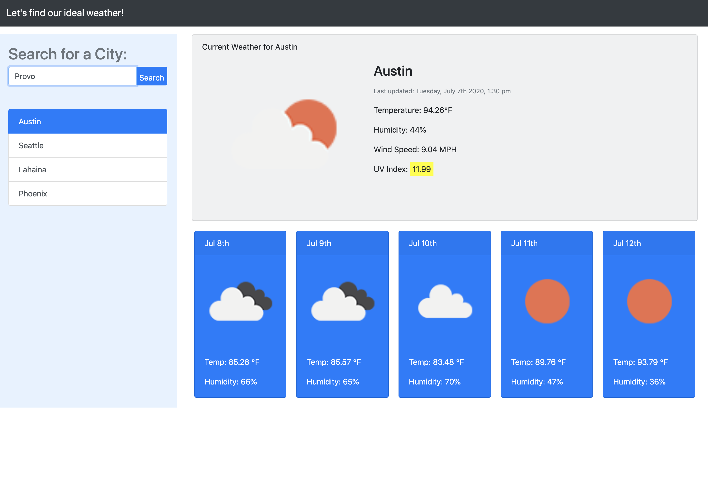

# weather-dashboard
The dashboard should tell you current weather and give a 5 day forecast for the city you choose.  I've been disecting this code for hours and I think I have everything in there but I keep getting an error for an $.ajax call.  I don't know why.  I'm going to keep working on it.  
UPDATE: I was using the minified version of a jquery source.  I fixed that so now I'm not getting the ajax error.  I went through all the code in my js file with a fine toothed comb and found some bugs that I squashed and things started to work how they are supposed to.  
NEW UPDATE: The weather dashboard gives you current weather and the 5 day forecast for the city you type into the search box.  It then saves the city you searched for in local storage so you can then just click the city for updated weather in that city.  When the page is first opened it asked if it can use your location.  I used a geolocation API call.  If you allow it to use your location it will give you the weather at (or near) your current location.  If you choose to block the site from knowing your location it gives the weather for a default location I chose.  
## HTML
The html is very basic from bootstrap.  Not too difficult anymore.  It's just a matter of putting the js calls into the right classes and ID's for the html.  I think I have a better grasp on html each time I do an assignment but I don't want to get to comfortable and complacent with it.  
## CSS
I feel the same about CSS as I do about HTML.  I have a pretty good understanding of it and it doesn't seem to difficult but I don't want to get comfortable and complacent and fall behind somewhere.
## JavaScript
This is where I have the issues.  I still have to use outside resources to help with the code and read it over and over, scroll top to bottom trying to figure out how everything connects and make everything connect.  I'm definitly not even close to being comfortable with JavaScript so it's not a matter of complacency, it's a matter of diligence and time.  I need to spend more time on it and researching and reading.
UPDATE: I went through the js file and studied it and figured things out to make it work how it is supposed to.  I am still having some issues but at least I am getting some functionality.  When I open the website in the live server it works like a dream.  When I open it with the default browser it has a never ending loop that crashes the browser.  I'm still working on that issue.   
UPDATED Update:  Met with a tutor today and was able to figure out why it had a never ending loop.  I had my code doing the same thing in two different places.  I had to change where I was calling the local storage into the get current city function.  
## Screenshot
This is a screenshot of the working app when I open it with the live server.   
## Link
https://dylandewey.github.io/weather-dashboard/

