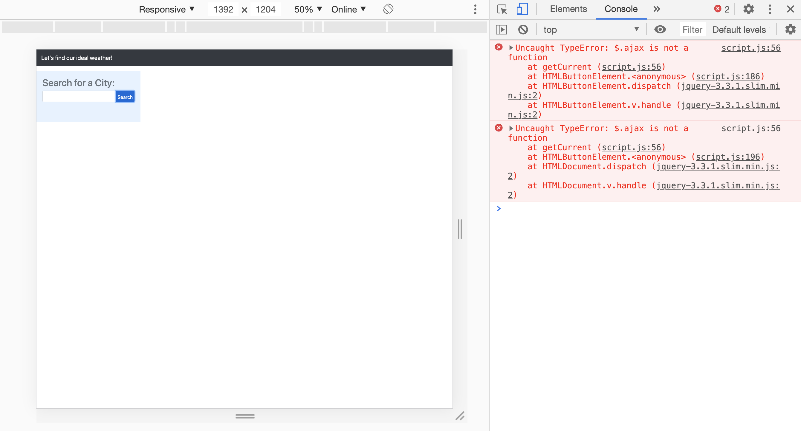

# weather-dashboard
The dashboard should tell you current weather and give a 5 day forecast for the city you choose.  I've been disecting this code for hours and I think I have everything in there but I keep getting an error for an $.ajax call.  I don't know why.  I'm going to keep working on it.  
## HTML
The html is very basic from bootstrap.  Not too difficult anymore.  It's just a matter of putting the js calls into the right classes and ID's for the html.  I think I have a better grasp on html each time I do an assignment but I don't want to get to comfortable and complacent with it.  
## CSS
I feel the same about CSS as I do about HTML.  I have a pretty good understanding of it and it doesn't seem to difficult but I don't want to get comfortable and complacent and fall behind somewhere.
## JavaScript
This is where I have the issues.  I still have to use outside resources to help with the code and read it over and over, scroll top to bottom trying to figure out how everything connects and make everything connect.  I'm definitly not even close to being comfortable with JavaScript so it's not a matter of complacency, it's a matter of diligence and time.  I need to spend more time on it and researching and reading.
## Screenshot
This is all I can get at this point.  Hopefully I can have it updated and working soon.  

